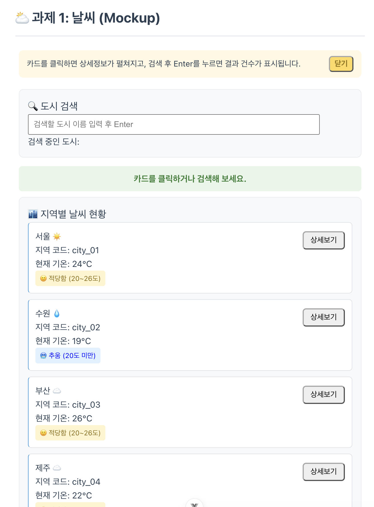
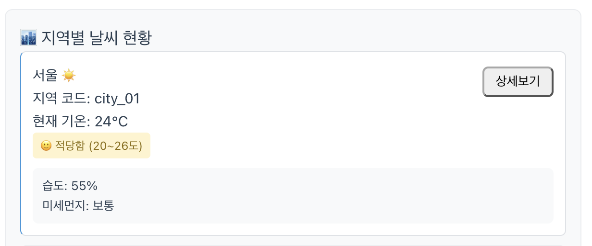
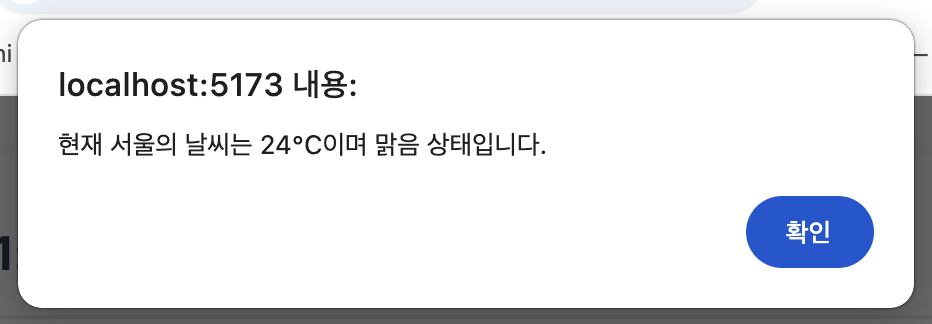
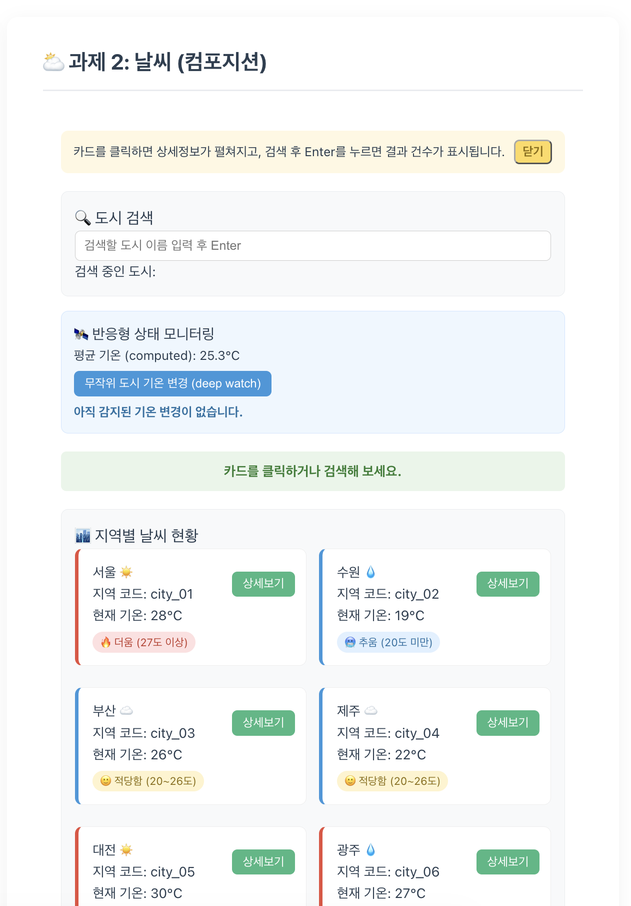
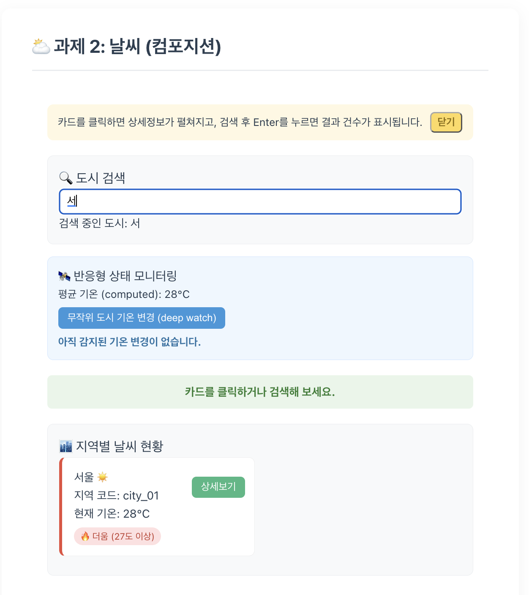
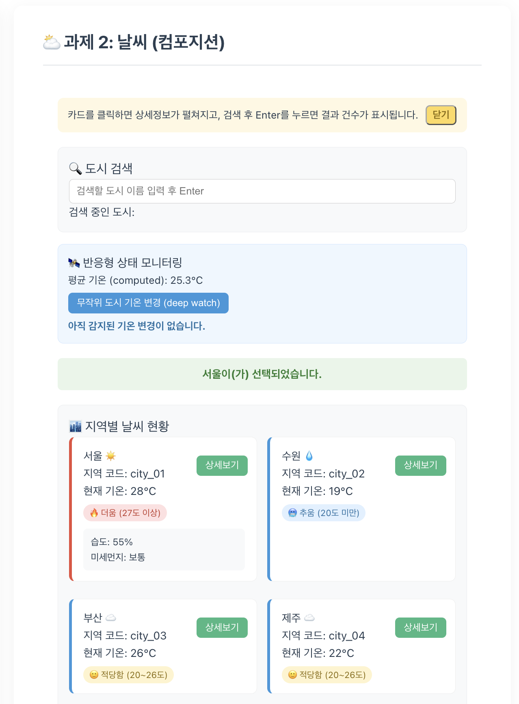
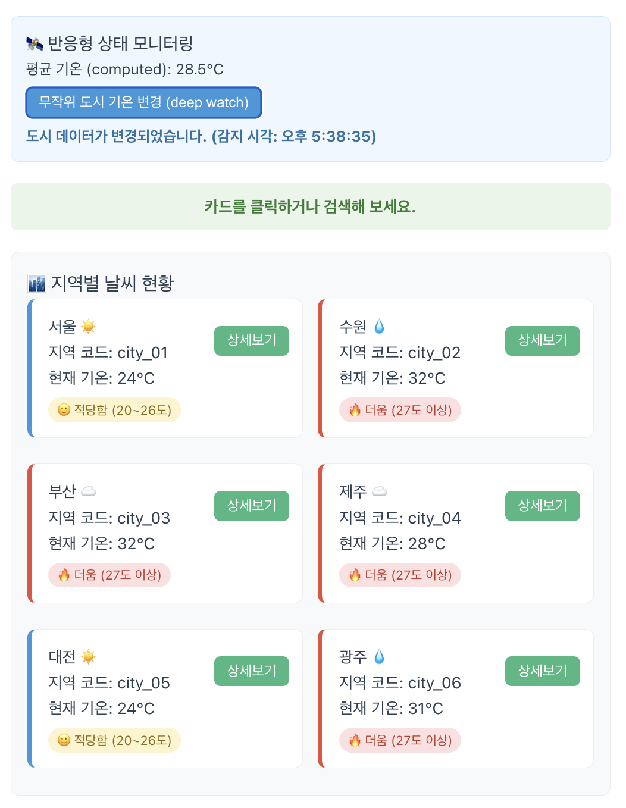

# skala-vue

SK SKALA 4기 Vue 실습 코드 - U123 손경락

# day3 과제 정리

## 컴포넌트 분리 (WeatherParent 외 5개)

- Mockup에서 만든 기능을 그대로 유지하면서 6개 컴포넌트로 쪼갬
- `BaseDashboardCard.vue`: 검색박스/리스트박스 공통 카드 스타일, `<slot>`으로 내용 주입
- `TipBanner.vue`: 안내 배너. `showTip`은 부모가 몰라도 되는 상태라 컴포넌트 내부에 로컬로 캡슐화, props/emits 없이 작업
- `SearchBar.vue`: `currentQuery`를 props로 받아 표시, 입력 시 `update-query` emit, Enter 입력 시 `search-enter` emit 추가
- `WeatherCard.vue`: `cityItem`, `isExpanded`(부모의 `expandedId`와 비교한 값)를 props로 받음, 이모지/3단계 기온 뱃지/테두리 색/지역코드는 컴포넌트 내부에서 계산, 클릭 시 `select-card`, 상세보기 클릭 시 `click-detail` emit
- `StatusBar.vue`: `message` props만 받아 표시하는 가장 단순한 컴포넌트
- 형제 컴포넌트(SearchBar, WeatherCard)끼리는 직접 통신할 수 없어서 `expandedId`/`searchQuery` 같은 공유 상태는 전부 WeatherParent가 들고 있다가 props로 내려주고 emit으로 올려받는 구조로 설계

## Vue Router 적용

- `router/index.js`: 모든 라우트를 `() => import(...)`로 지연 로딩(lazy loading), 마지막에 `/:pathMatch(.*)*` Catch-all Route로 404 처리
- `/` → `WeatherHomeView.vue`, `/about` → `WeatherAboutView.vue`, `/weather/:cityId` → `WeatherDetailView.vue`, `/stats` → `WeatherStatsView.vue`(추가 view), 나머지 전부 → `NotFoundView.vue`로 라우팅
- `WeatherHomeView.vue`: 상세보기 클릭 시 `window.alert()` 대신 `router.push('/weather/'+id)`로 상세 페이지 이동
- `WeatherCard.vue`의 `click-detail` emit을 `(name, temp, status)` 대신 `cityItem` 객체 전체로 통일(`select-card`와 동일 패턴) → 상세 페이지 이동에 필요한 `id`도 같이 전달
- `WeatherDetailView.vue`: 도시 코드별 상세 Mock Data(지역명/기온/상태/습도/풍속)를 만들어두고, `useRoute().params.cityId`를 `onMounted` 시점에 조회해 표시
- `WeatherAboutView.vue`: 서비스 소개 문구 + 대시보드로 돌아가기 버튼
- `WeatherStatsView.vue`: 등록 도시 수/평균 기온/최고·최저 기온 도시를 computed로 계산해 보여주는 통계 페이지
- `NotFoundView.vue`: 404 안내 문구 + 날씨 메인으로 이동 버튼
- `App.vue`의 네비게이션 바에 "📊 날씨 통계" 링크 추가

# day2 과제 정리

## WeatherMockup.vue 커스터마이징

- 데이터: 제주, 대전, 광주 데이터 추가 + humidity(습도), dust(미세먼지) 필드 추가
- 검색: `:value` + `@input`으로 구현, `@keyup.enter`로 검색 결과 건수를 상태바에 표시
- 카드 클릭: 상태바 갱신뿐 아니라 `expandedId`로 카드별 상세 패널 토글, 다시 클릭해 닫으면 상태바도 기본 문구로 복원
- 날씨 상태(맑음/비/구름)별 이모지 표시 (`weatherEmojiMap`)
- 기온 뱃지: 기존의 `v-if`/`v-else` 2단계(더움/선선함)를 → `v-if`/`v-else-if`/`v-else` 3단계(더움/적당함/추움)로 확장
- 카드에 지역코드 `item.id` 추가
- 카드 왼쪽 테두리 색을 기온에 따라 `:style` 바인딩으로 동적 변경
- 카드 안 상세정보 패널에 습도/미세먼지 표시
- alert에 현재 기온 추가 및 안내 문구 변경
- 안내 배너 추가: `v-show`로 노출 제어, 닫기 버튼에 `@click.once`로 최초 1회만 동작하도록 처리
- 검색 결과가 없을 때 안내 문구 추가
- `<style scoped>`로 개별 스타일 적용

## WeatherComposition.vue 커스터마이징

- Mockup에서 만든 기능에서 이어감
- 데이터: Mockup과 동일
- 검색 필터링은 Mockup의 함수 대신 `filteredWeatherList` computed로 구현
- `averageTemp` computed 추가: `filteredWeatherList`의 2차 계산된 속성으로, 검색 결과 도시들의 평균 기온을 실시간 계산
- `tempChangeLog` 반응형 상태 변수 추가: 기온 변경이 감지된 시각을 화면에 표시하기 위한 로그용 ref
- `weatherList`에 `{ deep: true }` watch 추가: 배열 자체가 아니라 배열 안 객체(city)의 기온 값이 바뀌는 것까지 감지
- `randomizeTemp()` 함수 + 버튼 추가: 무작위 도시의 기온을 바꿔 위 deep watch를 실제로 발동시켜보는 트리거
- 콘솔 로그만 남기던 기존 watch/watchEffect와 달리, 화면에도 모니터링 섹션으로 결과를 노출

---

# 배운 것 정리

# day1

## 파일 구조

- index.html: 앱 진입점, 브라우저가 최초로 읽는 단 하나의 HTML
- main.js: 뷰 어플리케이션을 초기화하고 구성하는 역할
- App.vue: 루트 컴포넌트
  - HelloWorld처럼 PascalCase로 작성

## 뷰의 3단 구조(SFC)

- script setup
- template
- style

## 반응형 데이터

- 그냥 선언한 변수는 화면이 새로고침 되어야만 반영됨
- ref(): 반응형 변수, 값이 바뀌면 바로 반영됨
- 버튼을 누르면 화면을 새로 고침함 -> 일반 변수(ref로 감싸지 않은 변수)도 같이 반영

## Vue Directive

- 'v-'접두사가 붙은 특수한 HTML 속성
- v-bind: Elements의 Attributes에 표현식(변수, 함수, 객체 등)을 동적 바인딩(:)
- v-model: 폼 입력'input'과 vue 인스턴스 데이터 간에 양방향 데이터 바인딩(인풋 값 할당)
- v-on: 클릭 또는 키 입력과 같은 사용자 이벤트에 응답하고자 지정 메서드 실행(@)

### v-bind

- HTML 태그 내부의 Attribute에 js 값을 동적으로 연결(binding)하는 지시자
- 실무에서는 앞에 콜론(:) 기호만 남김
- :href="URL"처럼 변수를 사용함(URL은 변수)
- class 바인딩
  - 값의 true/false에 따라 적용되는 스타일이 다름

### v-for, if

- 일반적인 사용법 동일

### v-show

- v-show가 붙은 해당 태그를 보여줄지 말지 결정

# day2

### v-pre

- 아무런 연산(해석)없이 그대로 출력

### v-cloak

- vue가 로딩되기 전까지 해당 구역을 물리적으로 숨김

### v-once

- 해당 요소와 하위 요소는 최초에 한 번만 반응형으로 렌더링
- 데이터가 변경되어도 DOM 갱신 X

### v-memo

- 지정한 조건(변수)이 바뀔 때만 태그 내부 업대이트
- 아니면 이전에 그린 화면(캐시) 그대로 재사용

### v-on

- DOM 요소에 이벤트 리스너 연결
- 주로 사용자 입력(클릭, 키보드 입력 등)에 반응
  - click: 클릭 이벤트
  - input: 입력 필드 변경 시
  - change: 입력 값 변경 후 포커스 아웃 시
- 이벤트 핸들링
  - Inline Handler
    - 태그 안에서 즉시 간단한 js 연산 처리 시 사용(숫자 증감, 스위치 토글 등)
  - Method Handler
    - 복잡한 로직은 script setup에 함수를 만들어서 호출

### 이벤트 객체

- e.type: String(발생한 이벤트의 종류. click, keyup, submit 등)
- e.preventDefault(): 브라우저가 특정 태그에 대해 가지는 기본 고유 동작을 강제로 중단 시킴
  - a 태그 눌렀을 때, 페이지가 링크로 이동하는 것 방지
  - form 태그의 submit 버튼을 눌렀을 때 새로 고침 방지
- `@click="handleEvent"` -> `const handleEvent = (e) => {}`
- `@click="handleEvent('홍길동', $event)"`

### 이벤트 수식어(Event Modifier)

- 이벤트 리스터의 기본 동작을 보완하거나 제어하는 데 사용되는 특수 접미어
  - .prevent: 태그의 기본 동작 방지(폼 제출 시 새로고침 방지, 링크 이동 방지)
  - .stop: 이벤트 버블링 차단(자식 버튼 클릭 시 부모 박스 이벤트로 전염 방지)
  - .once: 이벤트를 딱 한 번만 실행(설문 조사 제출 버튼 중복 클릭 방지)
  - .self: 오직 자기 자신을 직접 클릭했을 때만 이벤트 실행(자식 태그 클릭 시 패스)

## Composition API

### ref()

- 모든 값을 반응형 상태로 만든다
- 상단에 import해야 함
- 스크립트에서는 .value로 접근, 템플릿에서는 바로 접근

### reactive()

- 참조 자료형(객체, 배열, Map, Set)데이터를 반응형 상태로 만듦
- 반응성 단절
  - 반응형 객체를 교체하거나, 구조를 분해해야 할당하면 반응성 연결이 끊어짐

### computed()

- 원본 데이터가 바뀔 때만 알아서 다시 계산되는 계산기
- 일반 함수는 화면 재렌더링 될 때마다 다시 실행
  - 데이터가 바뀌지 않으면 기존 데이터 사용

### watch()

- 반응형 데이터의 값이 변경되었을 때 수행
- 첫 번째 인자로 감시할 데이터, 두 번째 인자(새로운 값, 이전 값)로 변경 시 콜백 함수 지정
- deep watch
  - 주소값까지 감시(객체를 감시할 때, 주소를 보고 있어서 값이 바뀌어도 모름)
  - {deep:true}을 3번째 파라미터로 사용
  - oldValue는 더이상 추적 불가
- reactive
  - 배열이나 객체 전체를 보면 이전 값 참조 불가
  - 특정 속성만 감시하면 이전 값 참조 가능 불가

# day3

## Component

- 표준화된 소프트웨어 모듈(블록/부품)
- 핵심: 독립성, 교체 가능성
- 전역 등록
  - main.js에서 app.component로 선언 하면 각 파일에서 import 없이 사용 가능
- 내장 함수
  - Lifecycle Hooks: setup(생성), onMounted(부착), onUpdated(갱신), onUnmounted(소멸)
  - Component Composition: defineProps, defineEmits
  - Dependency Injection: provide, inject

### Lifecycle Hook

- setup(): 생성 전(컴포넌트 불러온 후 화면 생성 전). 컴포넌트 생성 전 가장 먼저 실행. reactive 변수 및 함수 초기화
- onMounted(): 마운트(화면 생성 완료) 완료 후 실행. DOM에 마운트된 후 호출. 초기 DOM 조작, API 호출 등에 사용
- onUpdated(): 업데이트 후(데이터 변경된 시점). DOM 업데이트가 완료된 후 호출
- onUnmounted(): 언마운트 완료(이 페이지를 떠날 때). 컴포넌트가 DOM에서 제거된 후 호출

## Props & Emits

- 데이터는 위에서 아래로(props), 신호는 아래에서 위로(Emits)
  - Props는 자식에서 원본 데이터 수정 불가
  - Emits를 이용해서 원본 데이터 수정해달라고 요청

### defineProps()

- 자식 컴포넌트에서 부모가 넘겨줄 데이터(속성)의 이름과 규격을 선언
- Data는 camelCase로, 속성은 kebab-case로 작성

### defineEmits()

- 자식 컴포넌트에서 부모에게 이벤트 전달을 위한 매크로 함수
- @이벤트타입 = "이벤트핸들러"로 수신

### provide & inject

- props Drilling: props를 쓰지 않는 중간 컴포넌트는 전달자 역할을 해야함
- inject: 중간 컴포넌트 건너뛰기

## Component Slot

- 자식 컴포넌트의 특정 구역을 비워두고, 동적으로 받아 렌더링 하는 기능

## Router

- 페이지 이동
  - 전통 웹: 이동 시마다 화면 전체 새로고침
  - Vue: 최초 한 번만 HTML 파일 하나만 다운(SAP 구조)

### 설정하기

- src/router/index.js
- '/'를 사용해서 URL 관리
  - path: URL 경로
  - component: path에 매핑되는 vue 컴포넌트
- export default router로 외부 공유
- 실무에서는 동적 import 더 많이 사용(초기 로딩 속도 확보)

### 등록하기

- src/main.js
- import router from './router'로 가져오기(알아서 index.js를 읽음)
- app.use(router)로 라우터 등록

### 사용하기

- RouterLink to="..."으로 링크 생성
- RouterView: Link와 일치하는 컴포넌트 배치

### views 폴더

- 페이지(화면) 단위의 최상위 컴포넌트
- 구분
  - views 폴더(큰 페이지 하나씩)
    - 재사용성이 낮은 페이지(화면) 단위 컴포넌트
    - RouterView에 직접 매핑(routes에 등록)
    - URL Path와 1대1 대응
    - RouterView에 의해 직접 호출되는 최상위 페이지 컴포넌트에는 접미사 'view' 붙이기
  - component 폴더(페이지 안에 구성되는 요소들)
    - 재사용성이 높은 UI/기능 컴포넌트
    - RouterView에 직접 매핑 x

## useRoute()

- script setup 환경에서 현재 활성화된 라우트 정보에 접근하기 위한 Composable 함수
- 프로퍼티
  - params: 동적 경로 파라미터 객체 -> /user/:id => {id: '42'}
  - query: URL 쿼리 스트링 객체 -> /search?q=vue => {q: 'vue'}
  - path: 현재 요청된 URL의 순수 경로 -> /user/42
  - name: 해당 라우트 설정에 지정된 고유 이름 -> UserDetail

### 동적 경로 매칭

- 주소창 뒤에 콜론(:)을 붙여 변수화(/weather/:cityId)함
- 이 방식보다 쿼리 많이 씀

### Query String Routing

- 주소창 뒤에 물음표(?)에 이어 key=value 형태의 쌍으로 붙임
  - /weather?search=수원&page=2

## useRouter()

- script setup 환경에서 라우터 인스턴스에 접근하기 위한 Composable 함수
- 메소드
  - push(): 스택에 추가(뒤로 가기 가능)
  - replace(): 현재 히스토리 대체(뒤로 가기 불가)
  - go(n): 스택에서 n단계만큼 이동, -1은 뒤로가기

### Programmatic Navigation

- script 내부에서 페이지를 전환
- 메소드
  - push()
  - replace()
  - go(n)
  - back()
  - forward()

## Navigation Guard

- 특정 라우트 진입 전, 접근 권한 검사 및 리다이렉션 실행하게 함
  - 관리자 페이지나 마이 페이지를 비로그인 사용자 접근을 막음

### Global Guard

- 모든 Route 전환에서 사용자 정의 로직이 실행됨
- beforeEach: 새로운 이동 시작되기 직전
  - 접근 권한 통제 및 보안: 비로그인 사용자 차단
- beforeResolve: 라우트 진입 전, 컴포넌트 분석 모두 완료된 직후 트리거
  - 최종 데이터 검증 및 승인: 토큰, 데이터 확인
- afterEach: 화면 전환이 끝난 후
  - 후속 처리 및 로그 기록: 사용자 분석 로그 송신

### Unmatched Route Handling

- 라우트에 등록되지 않은 경로 예외 처리
- path: '/:pathMatch(.\*)\*'로 선언
