# SKALA Weather Dashboard

브라우저 Geolocation으로 내 위치 날씨를 즉시 보여주고, OpenWeatherMap API 4종(현재 날씨 · 5일 예보 · 대기질 · 지오코딩)을 조합해 시간별/일별 예보, 대기질, 지도, 통계까지 하나의 대시보드로 묶은 개인 프로젝트입니다.

**[🔗 배포 사이트 바로가기](https://skala-vue-smoky.vercel.app/)**

`Vue 3 (Composition API)` · `Vite` · `Pinia` · `Vue Router` · `Axios` · `OpenWeatherMap API` · `ApexCharts` · `Leaflet` · `VueUse` · `@lucide/vue`

---

## 목차

1. [스크린샷](#스크린샷)
2. [설계 하이라이트](#설계-하이라이트)
3. [사용 API](#사용-api)
4. [기술 스택과 선택 이유](#기술-스택과-선택-이유)
5. [폴더 구조](#폴더-구조)
6. [로컬 실행](#로컬-실행)

---

## 스크린샷

### 홈 — 내 위치 실시간 날씨

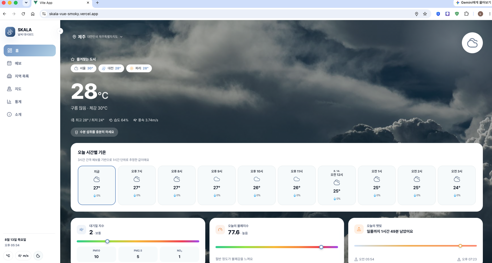
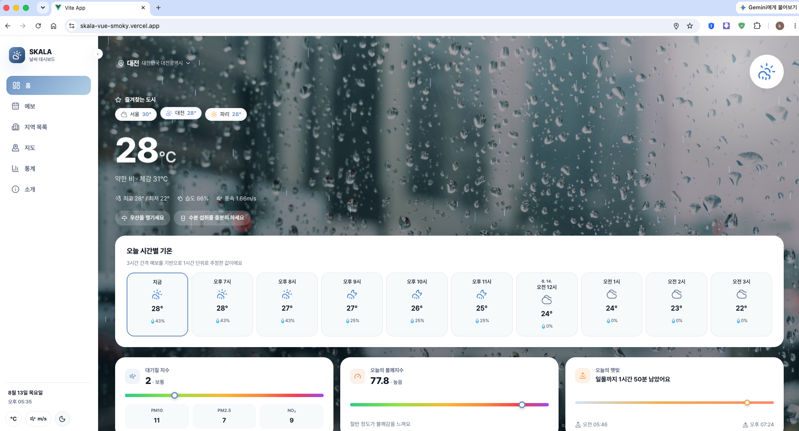
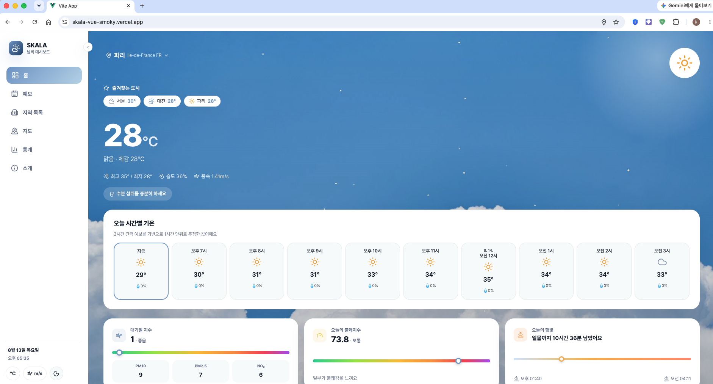
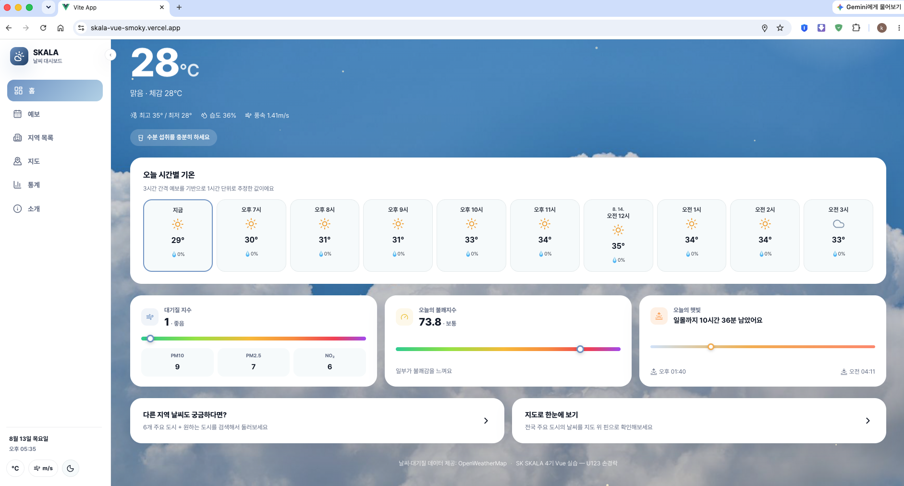
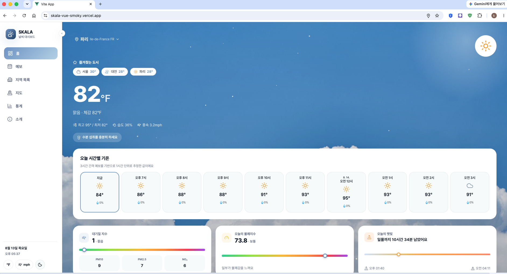

### 예보 상세 — 시간별 / 일별

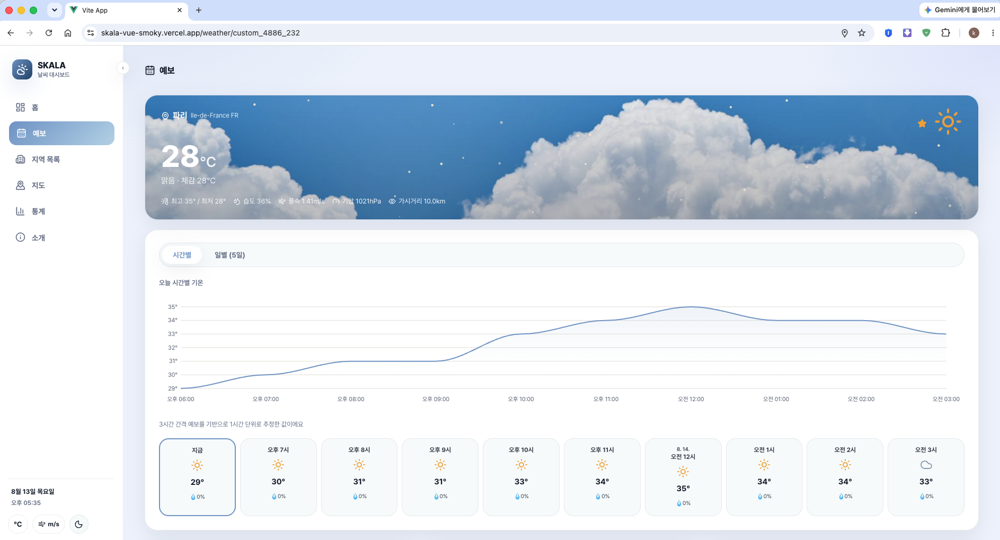
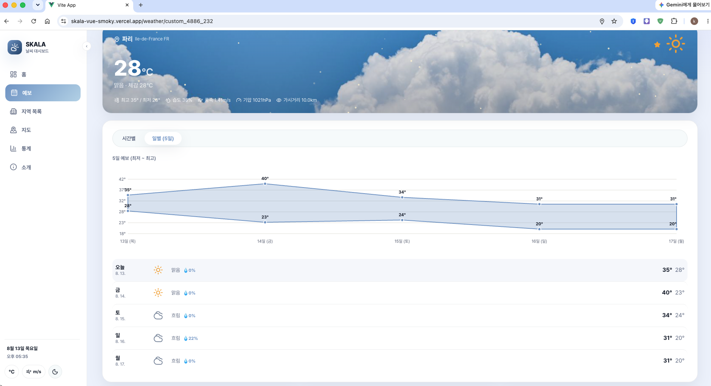

### 지역 목록 & 즐겨찾기

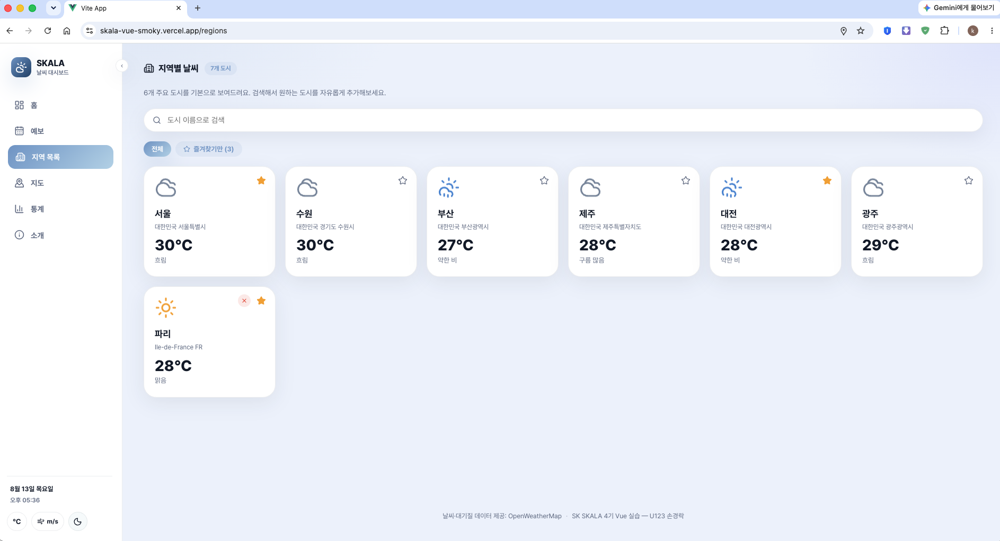
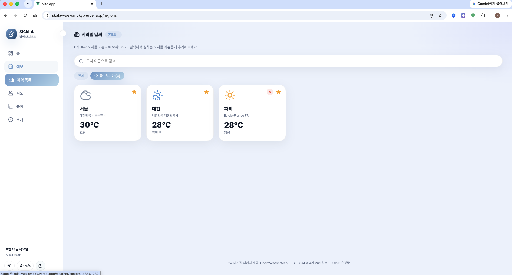

### 지도 — Leaflet 기반 다지역 비교

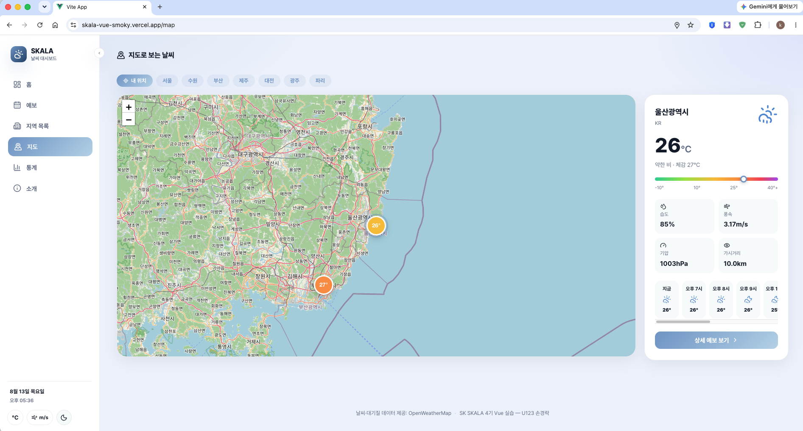
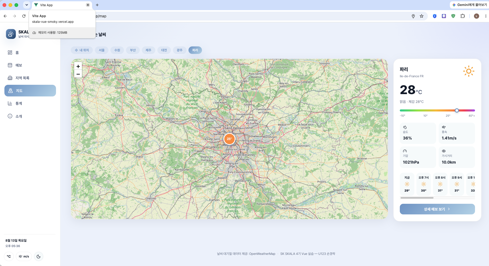

### 통계 · 소개

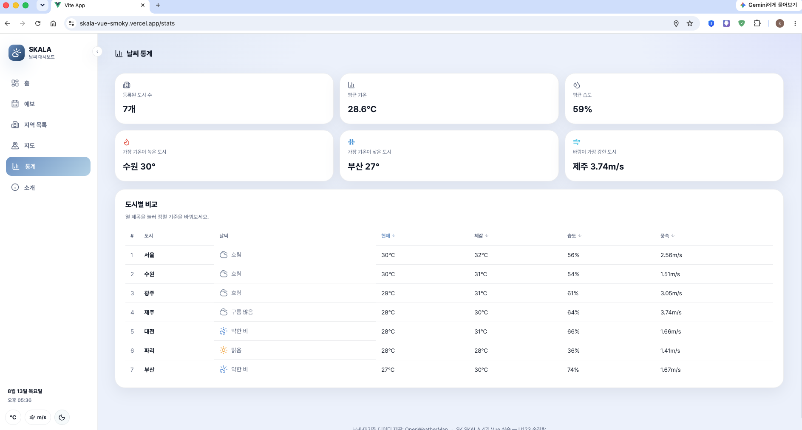
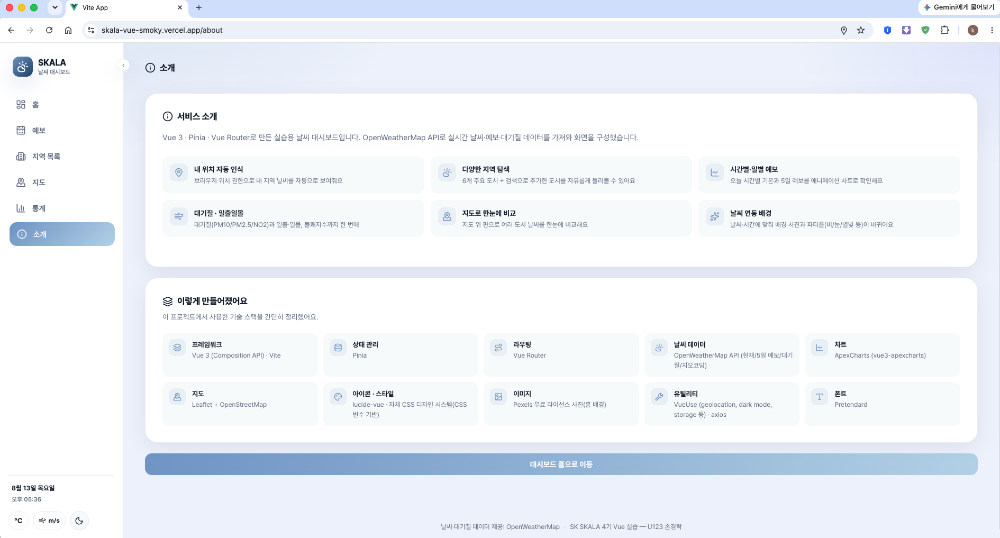

---

## 설계 하이라이트

### 1. Pinia 스토어 4개 — 도메인별 분리

| Store           | 책임                          | 영속화               |
| ---------------- | ------------------------------ | ---------------------- |
| `weatherStore`   | 도시별 API 캐시 · 검색 · 정규화 | 커스텀 도시만 `localStorage` |
| `selectionStore` | 화면 간 공유되는 선택 지역     | `localStorage`         |
| `favoriteStore`  | 즐겨찾기 도시 id               | 메모리                 |
| `configStore`    | 온도/풍속 단위 설정            | 메모리                 |

- 서버 캐시(`weatherStore`)와 클라이언트 상태를 분리 → 도메인 간 영향 없이 독립 테스트/교체 가능
- 영속화가 필요한 상태만 VueUse `useStorage`로 감싸 새로고침 후에도 유지

### 2. `weatherStore` — 정규화 캐시

`entries`(도시 id → `{ current, forecast, airQuality, isLoading*, error }`)를 `reactive`로 관리, 화면이 필요한 만큼만 요청.

- `fetchCurrent(id)` — 카드 그리드용 현재 날씨 1건
- `fetchDetail(id)` — 상세 페이지용 3개 API `Promise.all` 병렬 조회, 캐시 히트 시 재요청 안 함
- `normalizeCurrent`/`normalizeForecast`/`normalizeAirQuality` 순수 함수로 API 응답 → 뷰 모델 변환 계층 분리

```js
async function fetchDetail(id) {
  const entry = entries[id]
  if (entry.current && entry.forecast && entry.airQuality) return // 캐시 히트
  const [currentRes, forecastRes, airRes] = await Promise.all([
    axios.get(`${BASE_WEATHER_URL}/weather`, { params }),
    axios.get(`${BASE_WEATHER_URL}/forecast`, { params }),
    axios.get(`${BASE_WEATHER_URL}/air_pollution`, { params: airParams }),
  ])
  entry.current = normalizeCurrent(currentRes.data)
  entry.forecast = normalizeForecast(forecastRes.data.list)
  entry.airQuality = normalizeAirQuality(airRes.data)
}
```

### 3. 시간별 예보 보간

무료 플랜은 3시간 간격 예보만 제공 → `buildHourlySeries`가 인접 3시간 지점(anchor) 사이를 선형 보간해 1시간 단위 24시간 스트립 생성. 보간 무의미한 값(날씨 상태 등)은 직전 실측값 유지 + `estimated` 플래그로 구분.

### 4. 라우팅

- 전 라우트 동적 import로 지연 로딩
- `/weather/:cityId` 동적 세그먼트 + `/:pathMatch(.*)*` catch-all 404
- `scrollBehavior`로 전환 시 스크롤 최상단 초기화
- "예보" 탭은 `selectionStore.selectedCityId` 참조 → 항상 현재 선택 지역으로 이동

### 5. 날씨 반응형 테마 엔진

`weatherIconMap.js`가 아이콘 코드를 배경 사진·오버레이·파티클로 매핑하는 순수 함수 체인:

```text
iconCode('10n') → resolveGradientClass() → 'weather-gradient-rain'
                → HERO_PHOTOS[...] (배경 사진)
                → resolveParticleType() → 'rain' (파티클 타입)
```

낮/밤 접미사(d/n)까지 구분해 같은 '맑음'도 낮엔 sparkle, 밤엔 stars. `App.vue`(홈 배경)와 `WeatherDetailView.vue`(히어로 카드)가 동일 매핑 재사용.

### 6. Geolocation 부트스트랩

`App.vue` 최상단에서 1회만 구동해 `entries.me`를 채움. 권한 거부/6초 타임아웃 시 서울로 자동 폴백, 재시도 버튼 제공.

### 7. 코드 품질

- `oxlint`(빠른 1차 린트) → `eslint-plugin-vue`(상세 규칙) 순차 실행
- Prettier 별도 포맷팅
- `@` 별칭을 `vite.config.js`/`jsconfig.json`에 동기화

---

## 사용 API

모두 [OpenWeatherMap](https://openweathermap.org/api)에서 제공하는 API이며, `axios` 인스턴스로 호출 후 정규화 함수를 거쳐 화면에 전달됩니다.

| API                   | 엔드포인트                | 용도                                          |
| ---------------------- | -------------------------- | ---------------------------------------------- |
| Current Weather        | `/data/2.5/weather`        | 카드/상세 화면의 현재 기온·습도·풍속·일출일몰 |
| 5 Day / 3 Hour Forecast | `/data/2.5/forecast`       | 시간별(보간)·일별(5일) 예보                    |
| Air Pollution          | `/data/2.5/air_pollution`  | 미세먼지·초미세먼지·이산화질소 등 대기질 지수 |
| Geocoding (Direct)     | `/geo/1.0/direct`          | 도시명 검색 → 좌표 변환(지역 추가용)          |
| Geocoding (Reverse)    | `/geo/1.0/reverse`         | 브라우저 좌표 → 지명 변환(내 위치용)          |

---

## 기술 스택과 선택 이유

| 기술                        | 선택 이유                                                                                          |
| ---------------------------- | ---------------------------------------------------------------------------------------------------- |
| **Vue 3 Composition API**    | `ref`/`computed`/`watch` 단위로 로직을 응집시킬 수 있어, Options API보다 스토어·컴포넌트 간 로직 재사용이 쉬움 |
| **Pinia**                    | Vuex 대비 보일러플레이트가 적고, `defineStore`의 setup 문법이 Composition API와 자연스럽게 연결됨. Devtools 연동으로 상태 추적이 쉬움 |
| **VueUse**                   | `useStorage`(영속화), `useGeolocation`, `useDark`(다크모드) 등 브라우저 API를 반응형으로 감싸주어 직접 구현했을 때 생기는 중복 코드를 제거 |
| **Vite**                     | ESM 기반 개발 서버로 빠른 HMR, 동적 import 기반 코드 스플리팅과 궁합이 좋음                          |
| **ApexCharts**(`vue3-apexcharts`) | 애니메이션·툴팁이 기본 내장되어 있어 시간별/일별 예보 시각화를 적은 코드로 구현 가능                  |
| **Leaflet**                  | 경량 오픈소스 지도 라이브러리로, OSM 타일을 무료로 사용해 별도 API 키나 비용 없이 다지역 비교 지도를 구현 |
| **Axios**                    | 요청 인터셉터·`params` 직렬화 등 순수 `fetch` 대비 편의 기능 제공                                    |
| **@lucide/vue**               | 트리셰이킹 가능한 SVG 아이콘 세트로 번들 크기 최소화                                                  |

---

## 폴더 구조

```
src/
├── stores/                    # 도메인별 Pinia 스토어
│   ├── weatherStore.js        # API 호출/정규화/캐시 (핵심 로직)
│   ├── selectionStore.js      # 화면 간 공유되는 선택 지역
│   ├── favoriteStore.js       # 즐겨찾기
│   └── configStore.js         # 단위(온도/풍속) 설정
├── views/                     # 라우트에 매핑되는 페이지 컴포넌트
│   ├── WeatherHomeView.vue
│   ├── WeatherDetailView.vue
│   ├── WeatherRegionsView.vue
│   ├── WeatherMapView.vue
│   ├── WeatherStatsView.vue
│   ├── WeatherAboutView.vue
│   └── NotFoundView.vue
├── components/weather/        # 재사용 UI 컴포넌트
│   ├── CityCard.vue / WeatherIcon.vue / WeatherParticles.vue
│   ├── HourlyForecastChart.vue / DailyForecastChart.vue
│   ├── AirQualityCard.vue / DaylightBar.vue / DiscomfortCard.vue
│   └── SearchBox.vue / FavoriteToggle.vue / AdviceChips.vue
├── utils/
│   ├── weatherMath.js         # 불쾌지수/단위 변환/설명 매핑 등 순수 함수
│   └── weatherIconMap.js      # 아이콘 코드 → 테마/파티클 매핑
├── router/index.js            # 지연 로딩 라우트 정의
└── App.vue                    # 사이드바 셸 + 다크모드 + geolocation 부트스트랩
```

---

## 로컬 실행

```bash
git clone https://github.com/<your-id>/skala-vue.git
cd skala-vue
npm install

# .env 파일 생성 후 OpenWeatherMap API 키 입력
echo "VITE_OPENWEATHER_API_KEY=your_api_key_here" > .env

npm run dev       # 개발 서버 (http://localhost:5173)
npm run build     # 프로덕션 빌드
npm run preview   # 빌드 결과 미리보기
npm run lint      # oxlint → eslint 순차 실행
npm run format    # Prettier 포맷팅
```

---

SK SKALA 4기 Vue 실습 과정에서 시작해, 개인 프로젝트로 발전시킨 날씨 대시보드입니다.
